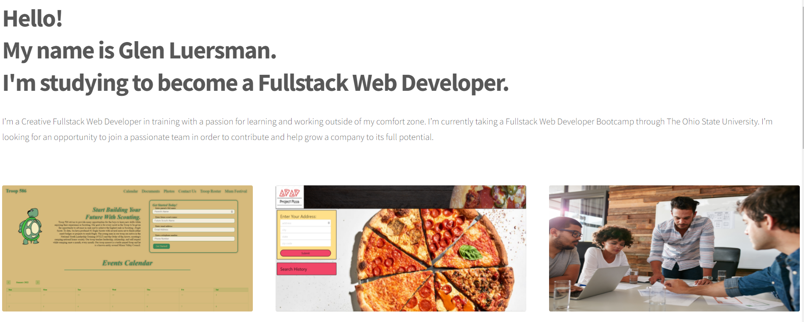
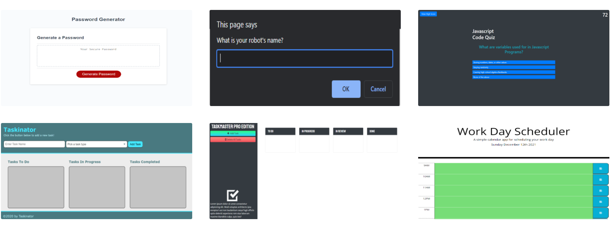
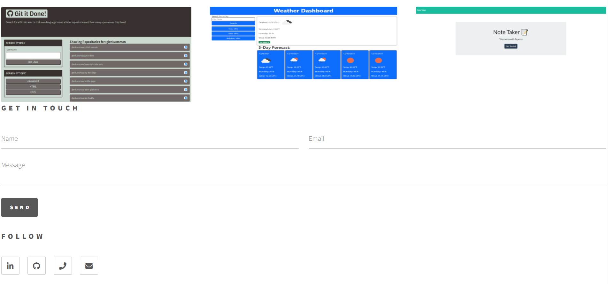

 </a>

<h3 align="center">Professional Portfolio</h3>

---

 
Visit my portfolio:
 <a href="https://glenluersman.com/">https://glenluersman.com/ </a>
 

## 

- [About](#about)
- [Usage](#usage)
- [Built With](#built_using)
- [Authors](#authors)
- [Questions](#questions)
- [Screenshots](#screenshots)

## 

This is my portfolio of past work. At the top of the page is a brief description of myself. Followed by image tiles that link to the deployment of that project. When you hover over the tile the title and a brief description of the project is displayed. Clicking on a tile will direct you to the deployment of the project. At the bottom of the page is several ways to get in touch with me.

## 

- HTML
- CSS/SCSS
- Javascript

## 

- [glenluersman](https://github.com/glenluersman)

## 

- Feel free to open an issue or contact me directly at glen.luersman@gmail.com if you have any questions about the repo. You can find more of my work at [glenluersman](https://github.com/glenluersman/).

## 

</a>

</a>

</a>
